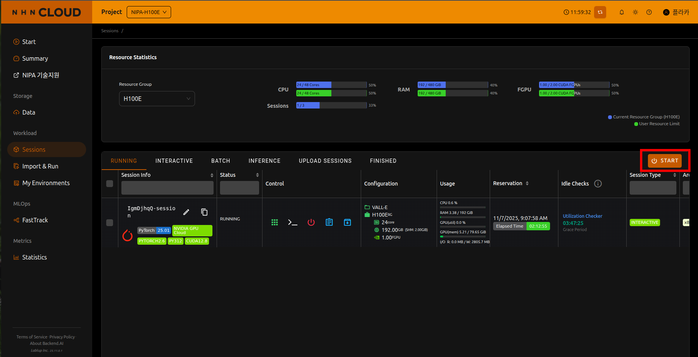
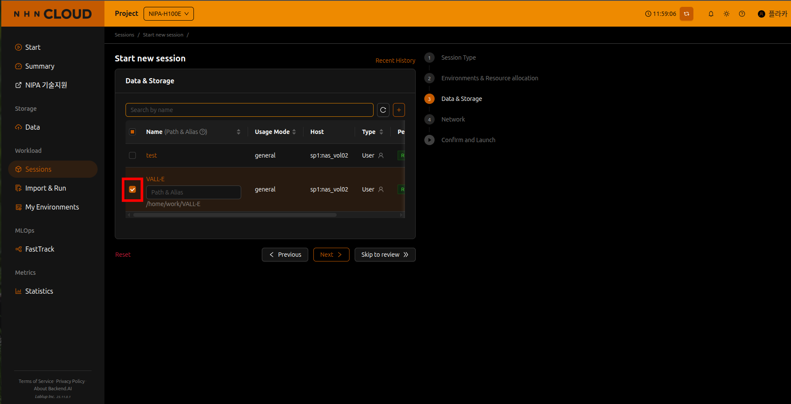
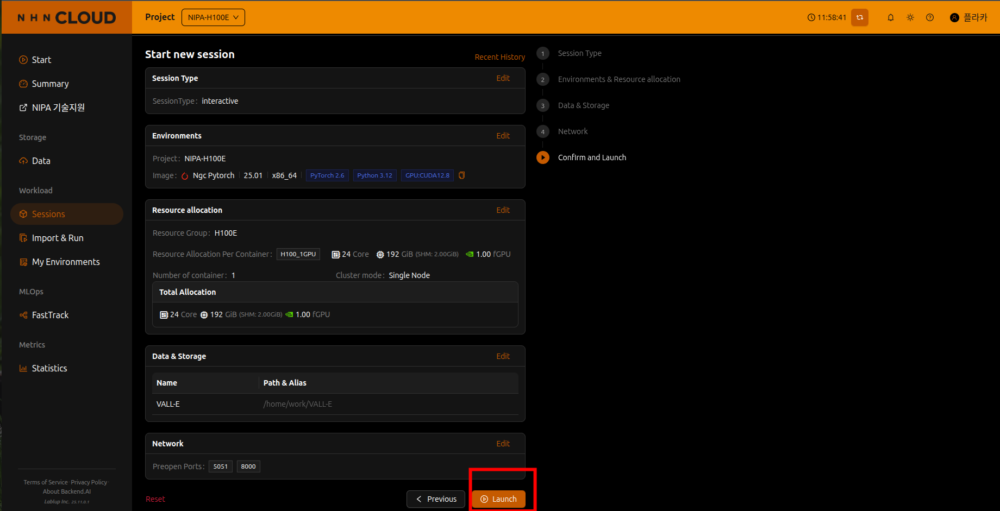
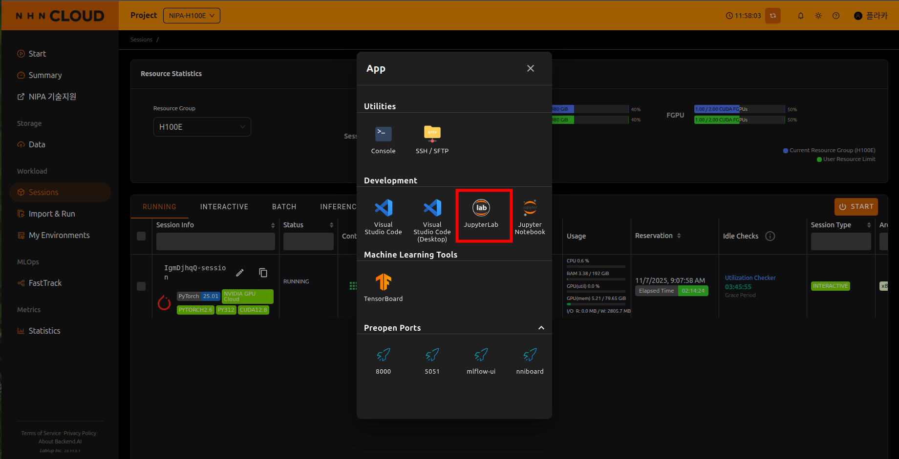
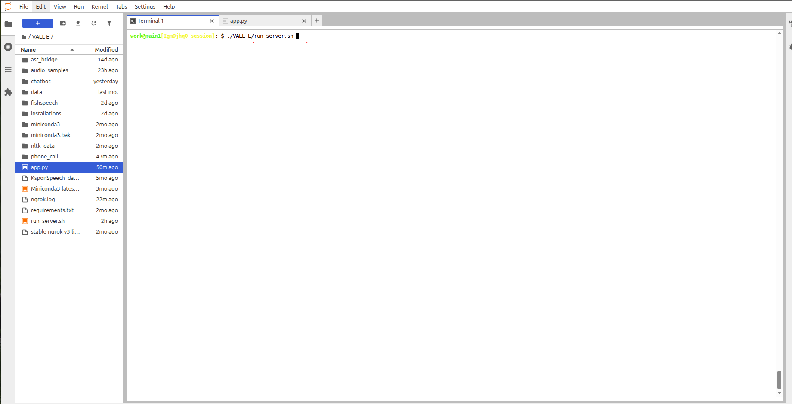
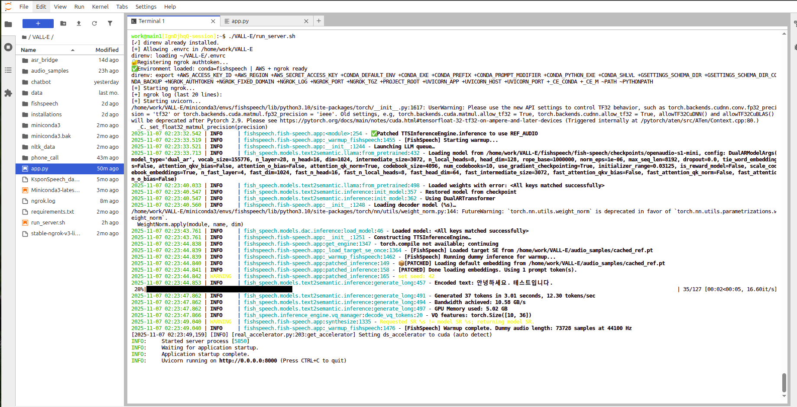
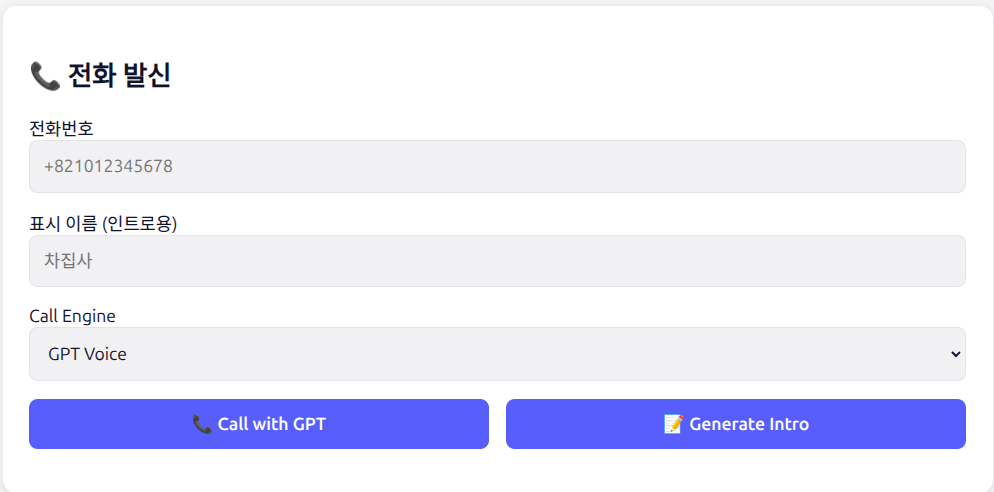
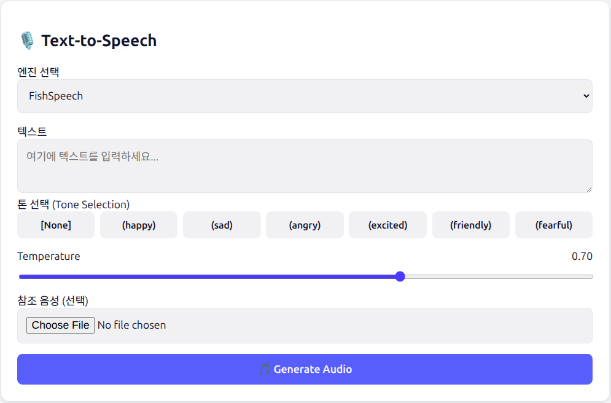
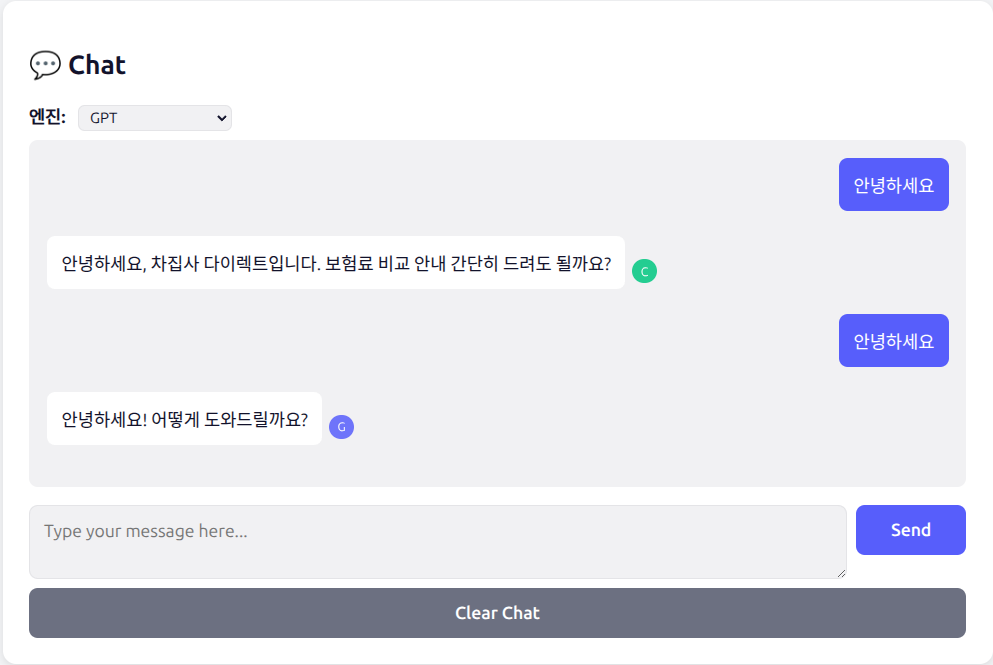

# 📞 AI Phone Call & TTS Control System  

---

## 🧩 System Overview

This system consists of **two connected parts**:

| Component | Location | Purpose |
|------------|-----------|----------|
| **1. NIPA Cloud Server** | Hosted on NIPA Cloud | Runs the core AI services — Text-to-Speech (FishSpeech), Chatbot, and Phone Call APIs. Handles AWS Connect integration, DynamoDB, and S3 audio uploads. |
| **2. Local Control Panel (Web UI)** | Run on local PC | A simple bilingual (KR/EN) interface used to initiate phone calls, generate greetings, and test TTS with uploaded reference audio. |

The local interface connects to the NIPA server via public domain.

---

## 🔐 1. Server Access (NIPA Cloud)

| Item | Details |
|------|----------|
| **Link** | https://nipa.nhncloud.com/|
| **ID** | nipa-gpu2025-668@ktcloud.com |
| **Password** | _insunetfc6276 |
| **Server URL** | https://honest-trivially-buffalo.ngrok-free.app |

---

## 🚀 2. Starting the NIPA Server

### Step 1 — Starting the server



### Step 2 — Mount VALL-E directory
Select VALL-E directory for mounting



### Step 3 — Select pre-open ports
Input ports 8000 and 5051


### Step 4 — Launch the server
Click on the launch button



### Step 5 — Selecting app dialog for server configuration
Click on app dialog button


### Step 6 — Select and open JupyterLab
Select JupyterLab



### Step 7 — Start the NIPA cloud server
Run ``` ./VALL-E/run_server.sh ```



### Step 8 — NIPA cloud server launch complete
This is the preview if the server launch is completed


---

## 💻 3. Starting the Local Control Panel (Client PC)

### Step 1 — Open terminal in project folder
```bash
cd /path/to/local_app
```

### Step 2 — Install dependencies
```bash
pip install fastapi uvicorn httpx
```

### Step 3 — Start the web app
```bash
uvicorn local_app:app --host 0.0.0.0 --port 5051
```

Then open your browser and go to:  
👉 **http://localhost:5051**

---

# 📘 4. Using the Local Web Interface (Updated)

## 🧭 Overview
The local web interface is now a **single unified page** with three main functional areas:

| Area | Name | Function |
|------|------|----------|
| 1️⃣ | **Phone Call Panel** | Start calls and generate personalized greetings |
| 2️⃣ | **Chat Interface** | Test and interact with the 차집사 chatbot (Chajipsa / GPT engines) |
| 3️⃣ | **TTS Utility (Optional)** | Generate voice audio via the local TTS server |

> 📌 Placeholder images shown below. Replace them with real screenshots later.

---

## 📱 1 — Phone Call Panel

The **top-left** section of the interface handles phone call operations.

### **Functions**
- Start outbound phone calls  
- Enter customer name & phone number  
- Generate personalized greetings:
  - Intro greeting (e.g., “안녕하세요, 홍길동 고객님…”)  
  - Personalized affirmative clip (“네, 홍길동님”)  

### **How to Use**
1. Enter the phone number  
2. (Optional) Enter the customer’s name  
3. Click **Generate Greeting**  
4. Click **Start Call** to begin the outbound call  

### **Screenshot Placeholder**


---

## 🎙️ 2 — TTS Utility

Located at the **bottom** of the page.

### **Functions**
- Generate voice audio  
- (Optional) Upload reference audio (`.wav`, `.m4a`)  
- Download or play generated audio  

### **How to Use**
1. Enter text into the TTS input  
2. (Optional) upload a reference voice file  
3. Click **Generate**  
4. The result will appear as an audio player with a download option  

### **Screenshot Placeholder**


---

## 💬 3 — Chat Interface

Located on the **right side** of the page.

### **Functions**
- Interactive chat with the 차집사 assistant  
- Switch between:
  - **Chajipsa engine**
  - **GPT engine**  
- Engine icons appear next to each assistant message  
- System log output shown underneath messages

### **How to Use**
1. Type your message in the chat box  
2. Choose the engine (Chajipsa or GPT)  
3. Press **Enter** or click **Send**  
4. Chat messages will appear continuously like a messenger UI  

### **Screenshot Placeholder**


---

## ⚠️ 5. Troubleshooting

| Issue | Cause | Solution |
|--------|--------|-----------|
| “Server is not running” message | NIPA server is offline or Ngrok disconnected | Reconnect Ngrok and restart `uvicorn app:app` |
| No sound / empty audio | Missing reference file or wrong prefix | Verify `/tts/synthesize2` works |
| Call not triggered | AWS Connect permission issue | Check Lambda + Connect integration |
| Browser stuck at “Generating…” | Timeout or memory issue | Check NIPA logs |

---

## 🧠 6. Next Steps

- [x] Web API and Control Panel completed  
- [ ] Train new multitask chatbot model (intent + response)  
- [ ] Integrate chatbot into phone call flow (optional Tab 3)

---
