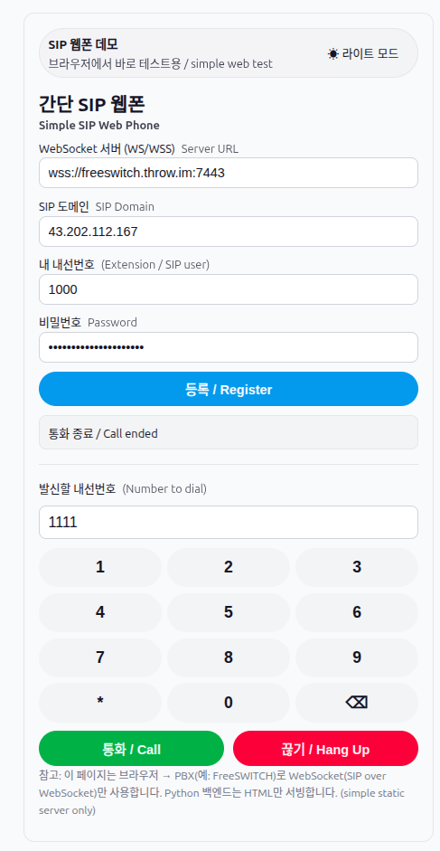
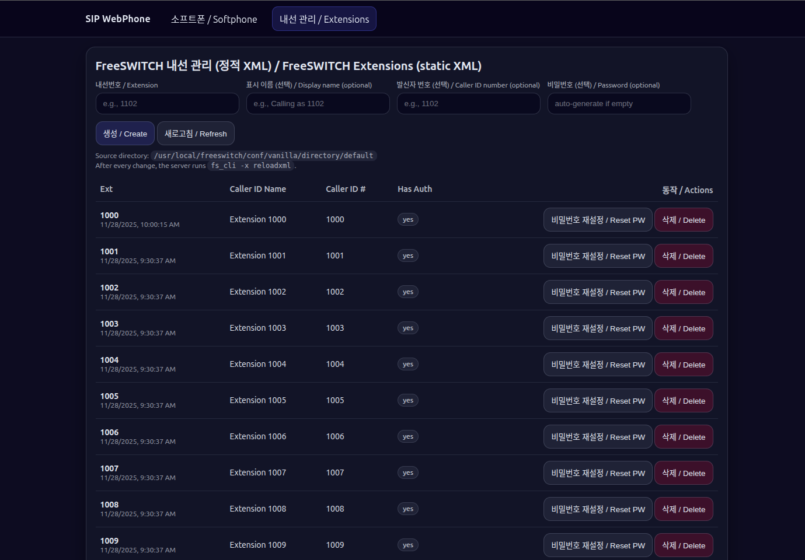

# SIP Web Phone & Extension Manager
*(FreeSWITCH + WebRTC)*

## 1. Overview

This system provides:

- A **browser-based SIP softphone** (WebRTC via JsSIP)
- A **web-based admin page** to manage FreeSWITCH extensions
- Static **FreeSWITCH XML directory** backend
- No SIP logic in Python — the backend only:
  - Serves HTML
  - Edits XML
  - Runs `fs_cli -x reloadxml`

---

## 2. Access URLs

| Function | URL |
|--------|-----|
| SIP Softphone | `https://<domain>/sip` |
| Extension Admin | `https://<domain>/sip/admin` |

A small ⚙️ **gear icon** appears at the **top-right of the softphone page** and links to the admin page.

---

## 3. SIP Softphone Page

### Features
- Register SIP extension via **WSS**
- Make / receive calls between extensions
- Dial pad with **backspace (⌫)**
- Light / Dark theme toggle
- Works with FreeSWITCH `mod_sofia` (WebSocket)

### Screenshot ① – SIP Softphone


---

## 4. Extension Admin Page

### Purpose
Manage **static XML extensions** located at:

```
/usr/local/freeswitch/conf/vanilla/directory/default/
```

Each extension corresponds to:
```
<extension>.xml
```

### Available Actions
- Create extension
- Set / reset password
- Edit caller ID name / number
- Delete extension
- Auto-runs `reloadxml` after every change

### Screenshot ② – Extension Manager


---

## 5. Admin Authentication (Important)

### How admin protection works

The admin page and API are protected using **HTTP Basic Auth**.

Authentication is **enabled only if** the environment variable is set:

```bash
SIP_ADMIN_PASS=<password>
```

Optional:
```bash
SIP_ADMIN_USER=admin   # default: admin
```

### Behavior

| Condition | Result |
|--------|-------|
| `SIP_ADMIN_PASS` unset | Admin page is open (dev mode) |
| `SIP_ADMIN_PASS` set | Browser prompts for username/password |

### Browser prompt
When you first visit `/sip/admin`, the browser shows a login dialog.

- **Username:** `admin` (or `SIP_ADMIN_USER`)
- **Password:** value of `SIP_ADMIN_PASS` (!insunet-fc)

---

## 6. Password Handling

- Passwords are stored in **FreeSWITCH XML**
- On creation:
  - If password field is empty → auto-generate
- On reset:
  - You can enter a custom password
  - Or leave blank to auto-generate
- Generated password is shown **once only**

---

## 7. Call Flow Summary

```
Browser (JsSIP)
   |
   |  SIP over WSS
   |
FreeSWITCH (mod_sofia)
   |
   |  RTP / SRTP
   |
Browser / SIP Phone
```

---

## 8. Operational Notes

- If audio becomes one-way:
  - Reload page
  - Re-register
  - Check browser mic permissions
- All extension changes require:
  - Write permission on directory XML
  - Successful `reloadxml`

---

## 9. Restart Commands

After code changes:

```bash
python3 -m py_compile sip_app.py
sudo systemctl restart sipapp
```

FreeSWITCH reload (automatic via admin):
```bash
fs_cli -x reloadxml
```
